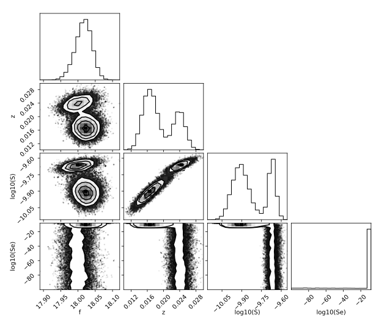

## Bayesian Modal Updating For System Identification

Implementation of a two-stage fast Bayesian system identification for separated nodes. This repository expands the usage of this technique by adding a mixture model fit to obtain modal parameters from the posterior distribution. This is not a peer reviewed apporach just and implementation that I made during a boring weekend.

### Get the Data

Create a "data" folder and download the dataset from the following link:

[Download Dataset](https://1drv.ms/f/c/ad540b8f16531ec4/Eg9_JhlPvXpHo-eqEOAl0tkBB0tP4tBCq_-2xiE-sWpjPw?e=RlCKAG)